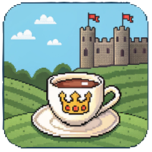

# 🗺️ Clash of Tea - Version 2

<div align="center">
  
  
  **An immersive team-based strategy game with interactive map and real-time statistics**

  [](https://vuejs.org/)
  [](LICENSE)
</div>

---

## 📋 Table of Contents

- [About](#-about)
- [Features](#-features)
- [Getting Started](#-getting-started)
- [How to Use](#-how-to-use)
- [Project Structure](#-project-structure)
- [API Configuration](#-api-configuration)

---

## 🎮 About

**Clash of Tea V2** is an interactive web application built with Vue.js that provides a strategic map interface for team-based gameplay. Navigate through beautifully designed medieval-themed map, track team progress, view building upgrades, and monitor player statistics in real-time.

---

## ✨ Features

### 🗺️ Interactive Map
- **Zoom Controls** - Seamlessly zoom in/out of the map with dedicated controls
- **Building Interaction** - Click on buildings to view detailed information
- **Team Selection** - Filter map view by team to see their territories
- **Responsive Design** - Optimized for desktop, tablet, and mobile devices

### 📊 Team Statistics
- **Resource Tracking** - Monitor team resources and building upgrades
- **Collapsible Panels** - Minimize/expand stats for better screen space
- **Drag & Drop** - Reorder resource buildings by preference
- **Live Activity Feed** - Real-time updates on team activities

### 🧭 Navigation
- **Compass Interface** - Beautiful compass-based navigation system
- **Quick Access** - Toggle between Map, Log, and FAQ pages
- **Collapsible Menu** - Minimize compass to save screen space

### 📜 Activity Logs
- **Player MVPs** - Leaderboards for top-performing players
- **Building MVPs** - Track which players excel at specific buildings
- **Team Roster** - View all team members and their alt accounts
- **Filtering Options** - Sort by total value or total drops

---

## 🚀 Getting Started

### Prerequisites

Before you begin, ensure you have the following installed:
- **Node.js** (v16.x or higher) - [Download](https://nodejs.org/)
- **npm** (v8.x or higher) or **yarn** (v1.22.x or higher)
- A modern web browser (Chrome, Firefox, Safari, or Edge)

### Installation

1. **Clone the repository**
   ```bash
   git clone https://github.com/yourusername/clash-of-tea-v2.git
   cd clash-of-tea-v2
   ```

2. **Install dependencies**
   ```bash
   npm install
   # or
   yarn install
   ```

3. **Configure environment variables**
   
   Create a `.env` file in the root directory:
   ```bash
   cp .env.example .env
   ```
   
   Update the API base URL in `.env`:
   ```env
   VITE_API_BASE_URL=http://localhost:3000
   ```

4. **Start the development server**
   ```bash
   npm run dev
   # or
   yarn dev
   ```

5. **Open your browser**
   
   Navigate to `http://localhost:5173` (or the port shown in your terminal)

## 🎯 How to Use

### Map Navigation

#### 🔍 Zooming
- **Mouse Wheel** - Scroll to zoom

#### 🏰 Building Interaction
1. **Select a Team** - Choose a team from the "Teams" panel in the bottom-right
2. **View Buildings** - Buildings belonging to the selected team will appear on the map
3. **Click Buildings** - Click any building marker to view:
   - Building name and current level
   - Current multipliers
   - Required resources for upgrade

#### 🧭 Compass Navigation
- **Click the Compass** - Located in the bottom-left corner
- **Navigate Pages**:
  - **MAP** (North) - Main interactive map view
  - **FAQ** (West) - Frequently asked questions
  - **LOG** (East) - Activity logs and statistics
- **Minimize** - Click the `✕` at the bottom of the compass to collapse it
- **Expand** - Click the hamburger menu `☰` to open the compass

### Team Stats Panel

Located in the **top-left corner**:

1. **Expand/Collapse** - Click the hamburger menu or `✕` to toggle
2. **Tabs Available**:
   - **💎 Resources** - View team's collected resources by building
   - **⚡ Live Feed** - Real-time activity updates
   - **📜 Latest** - Recent team achievements
3. **Resource Management**:
   - Click building headers to expand/collapse
   - Drag buildings to reorder by preference

### Log Page

Access via compass or navigation:

- **🛡️ Teams & Roster** - View all teams and their players
  - Hover over player badges to see alt accounts
- **🏆 MVPs** - Player leaderboards
  - Toggle between "Total Value" and "Total Drops"
  - Sort ascending or descending
- **🏰 Building MVPs** - Top performers per building
  - Filter by value or drop count

<div align="center">
  Made with ☕ and ❤️
  
  **[⬆ Back to Top](#-clash-of-tea---version-2)**
</div>